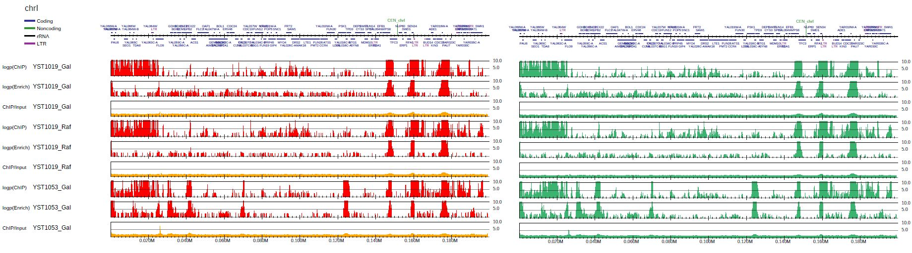

GENWIG: Generate wig data
-----------------------------------------

The **GENWIG** mode generates wig data of ChIP/Input enrichment and p-value distributions.
This mode is useful to analyze these distributions with Python and R by the user.

Here we use the yeast data used in :doc:`PCENRICH`.
To generate bigWig files of ChIP/Input enrichment for three sample pairs, type::

    dir=parse2wigdir+
    drompa+ GENWIG \
	-i $dir/YST1019_Gal_60min.100.bw,$dir/YST1019_Gal_0min.100.bw,YST1019_Gal \
	-i $dir/YST1019_Raf_60min.100.bw,$dir/YST1019_Raf_0min.100.bw,YST1019_Raf \
	-i $dir/YST1053_Gal_60min.100.bw,$dir/YST1053_Gal_0min.100.bw,YST1053_Gal \
	-o drompa-yeast --gt genometable.sacCer3.txt --outputformat 3 --outputvalue 0

then "drompa-yeast.YST1019_Gal.enrich.100.bw", "drompa-yeast.YST1019_Raf.enrich.100.bw" and "drompa-yeast.YST1053_Gal.enrich.100.bw" are generated.

The detail of ``--outputvalue`` option::

--outputvalue 0 (default): ChIP/Input enrichment
--outputvalue 1: P-value (ChIP internal)
--outputvalue 2: P-value (ChIP/Input enrichment

and ``--outputformat`` option::

--outputformat 0: compresed wig (.wig.gz)
--outputformat 1: uncompresed wig (.wig)
--outputformat 2: bedGraph (.bedGraph)
--outputformat 3 (default): bigWig (.bw)

Tutorial
++++++++++++++++++++

This is an example to generate a pdf file::

    dir=parse2wigdir+
    gene=data/S_cerevisiae/SGD_features.tab
    gt=data/genometable/genometable.sacCer3.txt
    drompa+ PC_ENRICH \
	-i $dir/YST1019_Gal_60min.100.bw,$dir/YST1019_Gal_0min.100.bw,YST1019_Gal \
	-i $dir/YST1019_Raf_60min.100.bw,$dir/YST1019_Raf_0min.100.bw,YST1019_Raf \
	-i $dir/YST1053_Gal_60min.100.bw,$dir/YST1053_Gal_0min.100.bw,YST1053_Gal \
	-o drompa-yeast --gt $gt -g $gene --gftype 2  --showpenrich 1 --showpinter 1 \
	--scale_ratio 5 --ls 200 --sm 10 --lpp 3

To generate the bigWig files shown in this pdf file, use **GENWIG** command as below::

    dir=parse2wigdir+
    gt=../data/genometable/genometable.sacCer3.txt
    drompa+ GENWIG \
	-i $dir/YST1019_Gal_60min.100.bw,$dir/YST1019_Gal_0min.100.bw,YST1019_Gal \
	-i $dir/YST1019_Raf_60min.100.bw,$dir/YST1019_Raf_0min.100.bw,YST1019_Raf \
	-i $dir/YST1053_Gal_60min.100.bw,$dir/YST1053_Gal_0min.100.bw,YST1053_Gal \
	-o drompa-yeast --gt $gt --outputformat 3 --outputvalue 0
    drompa+ GENWIG \
	-i $dir/YST1019_Gal_60min.100.bw,$dir/YST1019_Gal_0min.100.bw,YST1019_Gal \
	-i $dir/YST1019_Raf_60min.100.bw,$dir/YST1019_Raf_0min.100.bw,YST1019_Raf \
	-i $dir/YST1053_Gal_60min.100.bw,$dir/YST1053_Gal_0min.100.bw,YST1053_Gal \
	-o drompa-yeast --gt $gt --outputformat 3 --outputvalue 1
    drompa+ GENWIG \
	-i $dir/YST1019_Gal_60min.100.bw,$dir/YST1019_Gal_0min.100.bw,YST1019_Gal \
	-i $dir/YST1019_Raf_60min.100.bw,$dir/YST1019_Raf_0min.100.bw,YST1019_Raf \
	-i $dir/YST1053_Gal_60min.100.bw,$dir/YST1053_Gal_0min.100.bw,YST1053_Gal \
	-o drompa-yeast --gt $gt --outputformat 3 --outputvalue 2

Verify the generated bigWig files can generate the same distribution::

    s=""
    for sample in YST1019_Gal YST1019_Raf YST1053_Gal; do
        for str in pinter penrich enrich; do
        	s="$s -i drompa-yeast.$sample.$str.100.bw"
        done
    done

    drompa+ PC_SHARP $s -o drompa-yeast_genwig --gt $gt -g $gene --gftype 2 \
      	--scale_tag 5 --ls 200 --sm 10 --lpp 3

   The original pdf file (left) and the pdf using bigWig files generated by GENWIG command (right).
