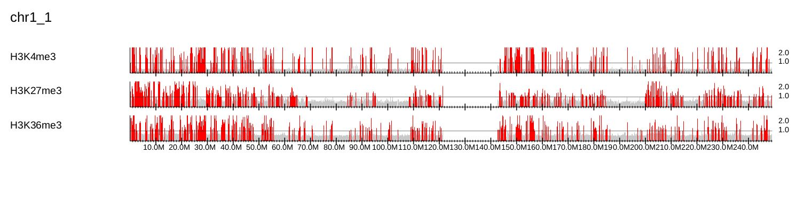
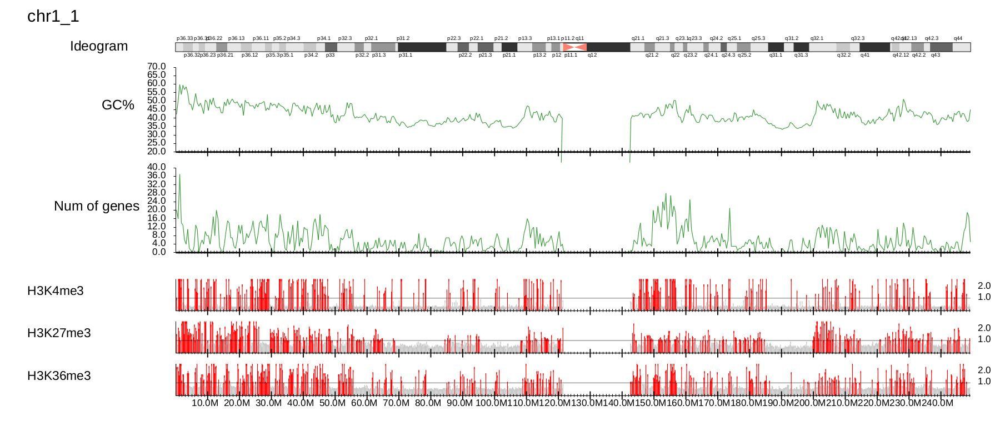

GV: Whole-chromosome view
-----------------------------------------

The **GV** mode shows a chromosome-wide overview of the ChIP-seq data. Type::

    $ dir=parse2wigdir+
    $ drompa+ GV \
	-i $dir/H3K4me3.100000.bw,$dir/Input.100000.bw,H3K4me3   \
	-i $dir/H3K27me3.100000.bw,$dir/Input.100000.bw,H3K27me3 \
	-i $dir/H3K36me3.100000.bw,$dir/Input.100000.bw,H3K36me3 \
	-o drompaGV-K562 --gt genometable.txt

100k-bp bin is recommended for **GV** mode.
**GV** mode does not perform the significance test but simply highlights the bins containing ChIP/Input enrichments above the middle of y axis (specified with ``--scale_ratio``) in red.

**GV** mode can include various annotation::

    $ dir=parse2wigdir+
    $ drompa+ GV \
	-i $dir/H3K4me3.100000.bw,$dir/Input.100000.bw,H3K4me3   \
	-i $dir/H3K27me3.100000.bw,$dir/Input.100000.bw,H3K27me3 \
	-i $dir/H3K36me3.100000.bw,$dir/Input.100000.bw,H3K36me3 \
	-o drompaGV-K562_2 --gt genometable.txt \
	--GC GCcontents --gcsize 500000 \   # GC contents directory and window size (500 kbp)
	--GD genedensity --gdsize 500000 \  # Gene-density directory and window size (500 kbp)
	--ideogram ../data/ideogram/hg19.tsv  # ideogram

This command can work in "tutorial" directory. Ideogram data for several species is available in "data/ideogram" directory. 

The result is shown below:

