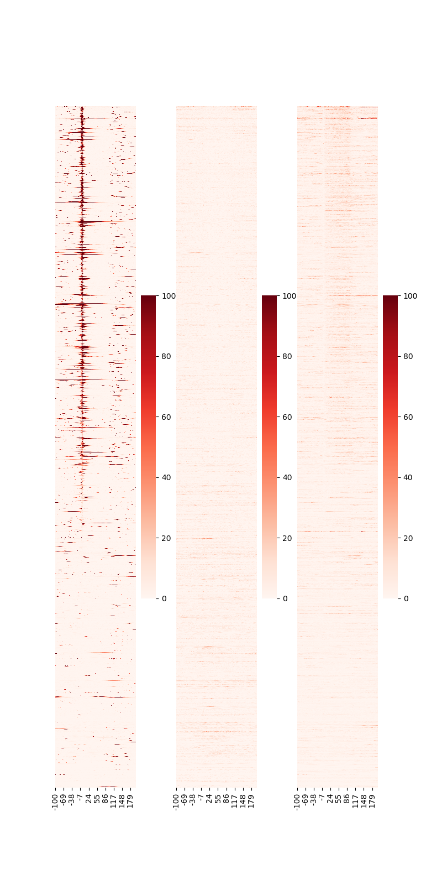

HEATMAP (using Python3)
====================================

DROMAplus has a script ``drompa.heatmap.py`` in "otherbin" directiry. It utilizes the .tsv file generated by *PROFILE* command and draw a heatmap using Python. This script requires pandas, matplotlib and seaborn libraries.

The command::

    drompa.heatmap.py \
       -o heatmap-aroundTSS \
       profile-K562-aroundTSS.ChIPread.H3K4me3.tsv \
       profile-K562-aroundTSS.ChIPread.H3K27me3.tsv \
       profile-K562-aroundTSS.ChIPread.H3K36me3.tsv

generates the .png file as below:

.. image:: img/heatmap.aroundTSS.png
   :width: 400px
   :align: center

The rows are sorted by the center position ("0" of x-axis) of 1st sample. Specify ``--sortid`` to change the sample to be sorted. Also, specify ``--notsort`` is sorting is not necessary. ``--vmax`` option can be used to change the colorscale of the heatmap.

The command::

    drompa.heatmap.py \
       -o heatmap-aroundGene \
       profile-K562-aroundGene.ChIPread.H3K4me3.tsv \
       profile-K562-aroundGene.ChIPread.H3K27me3.tsv \
       profile-K562-aroundGene.ChIPread.H3K36me3.tsv

generates the .png file as below:

