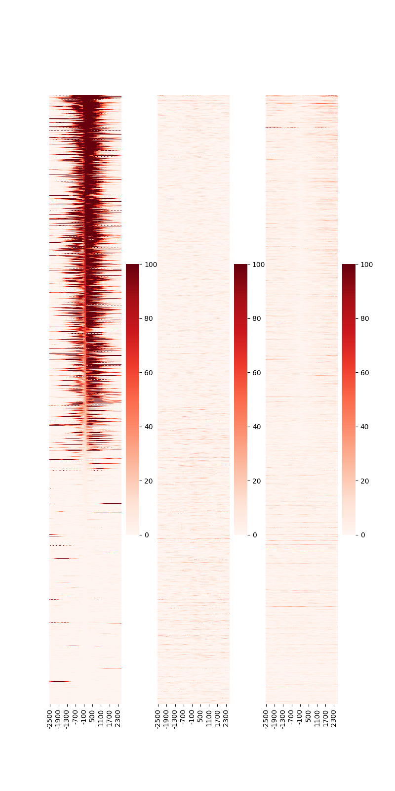

HEATMAP (using Python3)
-----------------------------------------

The TSV files generated by **PROFILE** command describe the mapped read number of each site. This data can also be used for heatmap analysis.

DROMAplus has a Python3 script, ``drompa.heatmap.py`` in the "otherbins" directory that generates a heatmap PNG file from the TSV files. This script requires the *pandas*, *matplotlib* and *seaborn* libraries.

The following command::

    drompa.heatmap.py \
       -o heatmap-aroundTSS \
       profile-K562-aroundTSS.ChIPread.H3K4me3.tsv \
       profile-K562-aroundTSS.ChIPread.H3K27me3.tsv \
       profile-K562-aroundTSS.ChIPread.H3K36me3.tsv

generates the PNG shown in :numref:`heatmap1`.

   Heatmap around TSS.

The rows are sorted by the center position ("0" on the x-axis) of the 1st sample. Specify ``--sortid`` to change the sample to be sorted.
Additionally, specify ``--notsort`` if sorting is not necessary.
The ``--vmax`` option can be used to change the color scale of the heatmap.

The following command::

    drompa.heatmap.py \
       -o heatmap-aroundGene \
       profile-K562-aroundGene.ChIPread.H3K4me3.tsv \
       profile-K562-aroundGene.ChIPread.H3K27me3.tsv \
       profile-K562-aroundGene.ChIPread.H3K36me3.tsv

generates the PNG file shown in :numref:`heatmap2`.

   Heatmap around gene.
