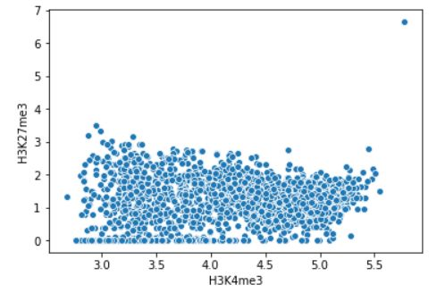
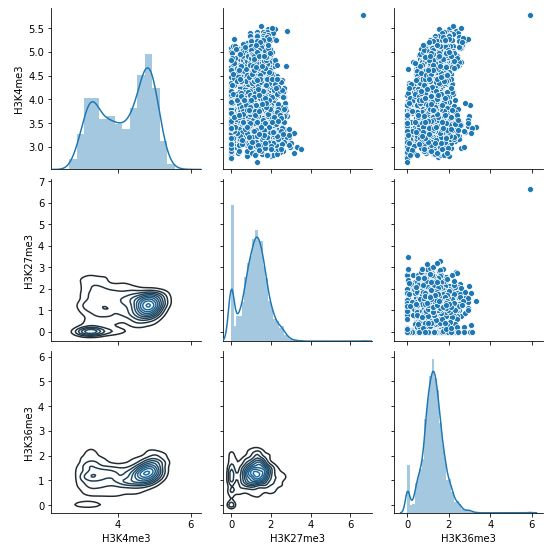

MULTICI: Generate matrix of averaged read density
----------------------------------------------------

The **MULTICI** generates a matrix file that describes the averaged read density in specified BED site::

    dir=parse2wigdir+
    gt=genometable.hg19.txt
    drompa+ MULTICI \
    -i $dir/H3K4me3.100.bw,$dir/Input.100.bw,H3K4me3 \
    -i $dir/H3K27me3.100.bw,$dir/Input.100.bw,H3K27me3 \
    -i $dir/H3K36me3.100.bw,$dir/Input.100.bw,H3K36me3 \
    -o drompa --gt $gt --bed H3K4me3.bed

The output file (``drompa.MULTICI.averaged.ChIPread.tsv``) is a tab-delimited TSV file that contains the averaged ChIP-read intensity per bin size for each BED site like this::

     $ head drompa.MULTICI.averaged.ChIPread.tsv
             H3K4me3 H3K27me3        H3K36me3
     chr1-137600-138199      38.5659 0       3.15773
     chr1-138400-139599      30.6127 1.21359 3.48057
     chr1-713000-715499      60.1785 1.05242 1.16351
     chr1-761200-761499      21.2679 0       5.60837
     chr1-761900-763299      69.3009 0.57135 0.947986
     chr1-839300-840799      38.307  1.33495 0.7842
     chr1-858900-859099      26.1827 13.0429 0
     chr1-859300-861299      48.3319 8.51783 0.29999
     chr1-875800-876399      48.9127 14.4279 1.93347

Output ChIP/Input enrichment
++++++++++++++++++++++++++++++++++++++

Add ``--stype 1`` to generate averaged ChIP/Input enrichment table::

    dir=parse2wigdir+
    gt=genometable.hg19.txt
    drompa+ MULTICI \
    -i $dir/H3K4me3.100.bw,$dir/Input.100.bw,H3K4me3 \
    -i $dir/H3K27me3.100.bw,$dir/Input.100.bw,H3K27me3 \
    -i $dir/H3K36me3.100.bw,$dir/Input.100.bw,H3K36me3 \
    -o drompa --gt $gt --bed H3K4me3.bed --stype 1

then ``drompa.MULTICI.averaged.Enrichment.tsv`` is outputted.

Output the maximum bin value
++++++++++++++++++++++++++++++++++++++

In default, **MULTICI** command output the averaged value of bins included in each site. If the user wants to output the maximum value among bins included in each site, supply ``--maxvalue`` option::

        dir=parse2wigdir+
        gt=genometable.hg19.txt
        drompa+ MULTICI \
        -i $dir/H3K4me3.100.bw,$dir/Input.100.bw,H3K4me3 \
        -i $dir/H3K27me3.100.bw,$dir/Input.100.bw,H3K27me3 \
        -i $dir/H3K36me3.100.bw,$dir/Input.100.bw,H3K36me3 \
        -o drompa --gt $gt --bed H3K4me3.bed --maxvalue

then ``drompa.MULTICI.maxvalue.ChIPread.tsv`` is outputted.

Visualization using MULTICI
++++++++++++++++++++++++++++++++++++++

Here I introduce two example python commands to visualize the output file
of **MULTICI** (here ``drompa.MULTICI.averaged.ChIPread.tsv``).

The command below draws a scatter plot between two samples.

.. code-block:: python3

     import numpy as np
     import pandas as pd
     import seaborn as sns

     df = pd.read_csv("drompa.MULTICI.averaged.ChIPread.tsv", sep="\t", index_col=0)
     logdf = np.log1p(df)
     sns.scatterplot(logdf.iloc[:,0], logdf.iloc[:,1])

   Scatterplot (log-scale) between H3K4me3 and H3K27me3 within H3K4me3 peaks.

The command below draws a pairplot among all samples.

.. code-block:: python3

       import numpy as np
       import pandas as pd
       import seaborn as sns

       df = pd.read_csv("drompa.MULTICI.averaged.ChIPread.tsv", sep="\t", index_col=0)
       logdf = np.log1p(df)
       g = sns.PairGrid(logdf)
       g.map_upper(sns.scatterplot)
       g.map_diag(sns.distplot)
       g.map_lower(sns.kdeplot)

     Pairplot (log-scale) among three samples within H3K4me3 peaks.
