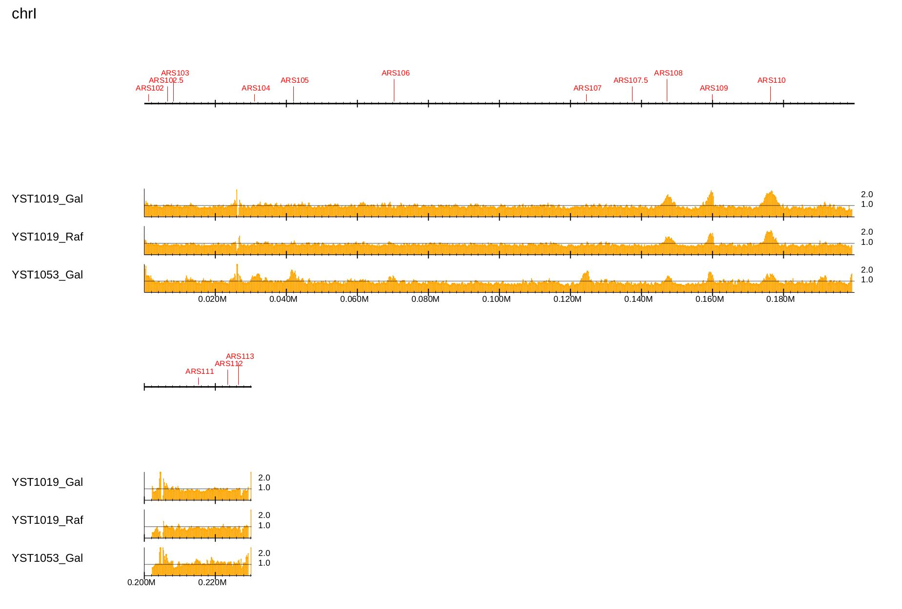
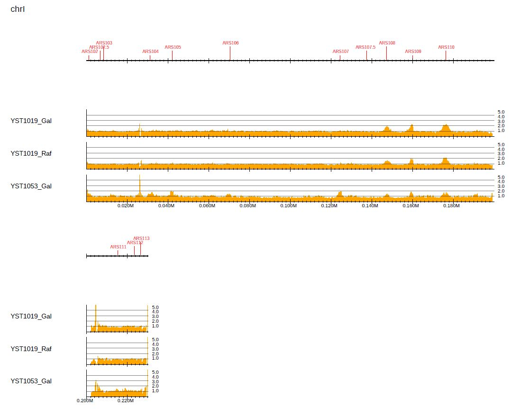
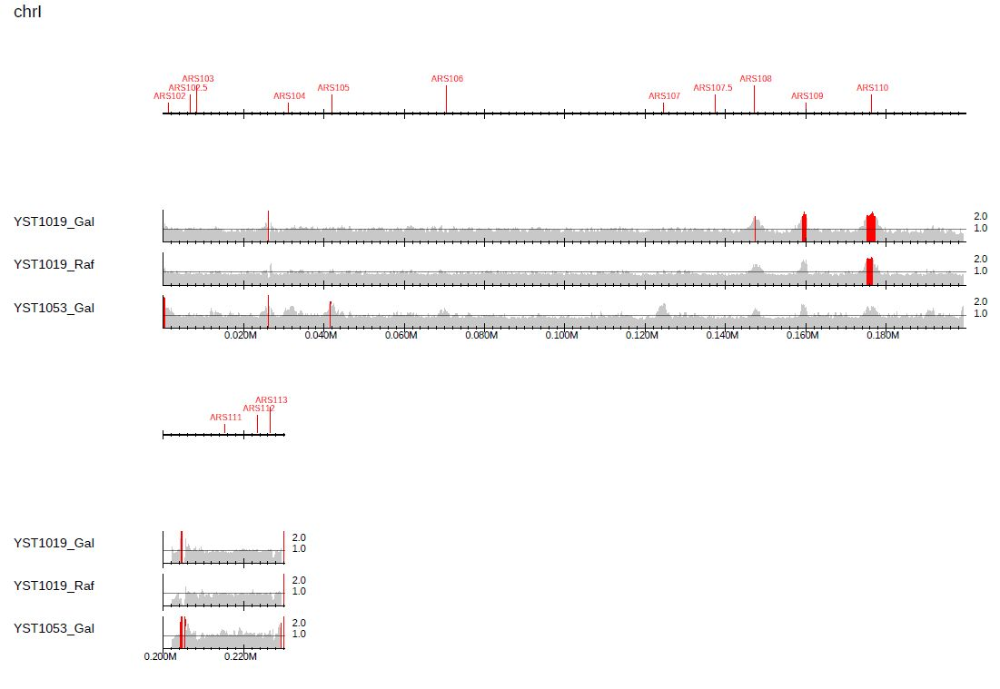
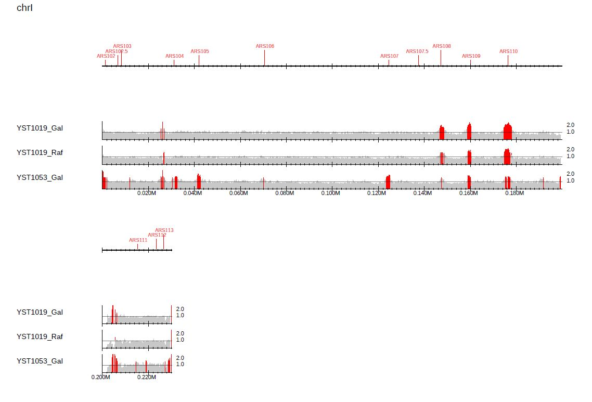
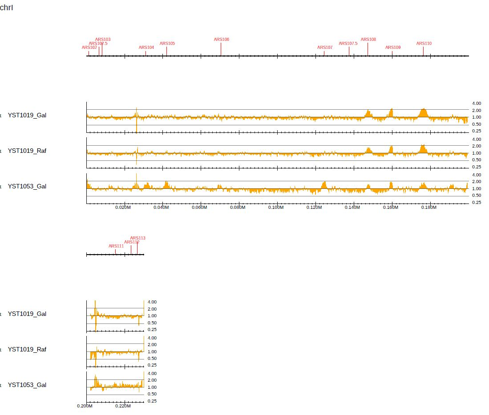
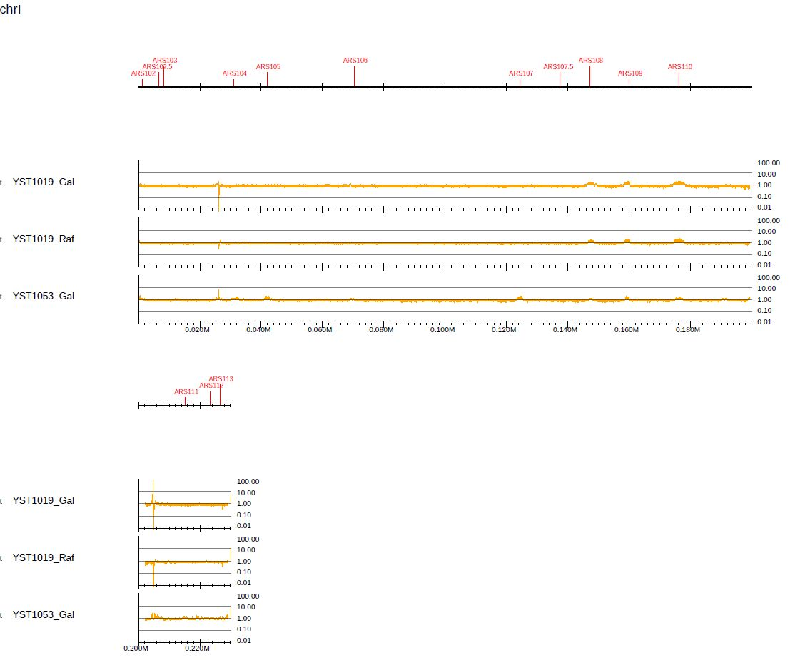
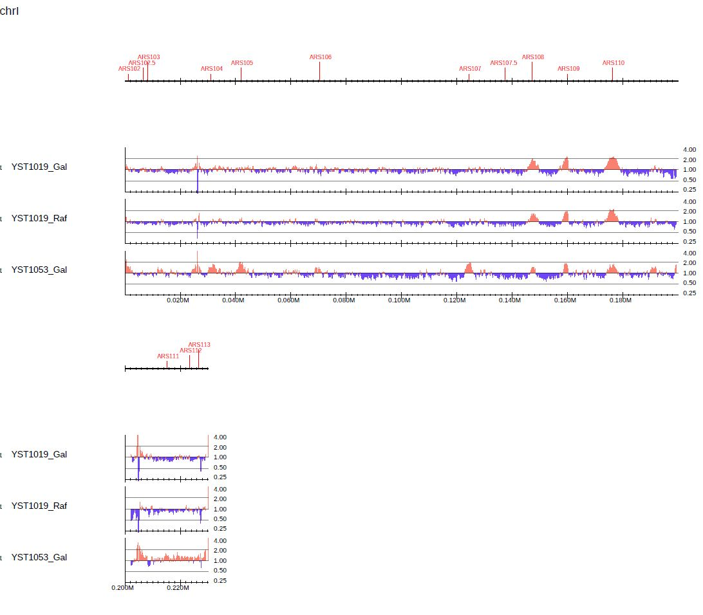

PC_ENRICH: Enrichment visualization
-----------------------------------------

For a small genome (e.g., yeast), the sequencing depth is generally enough (> 10-fold). In such cases, the genome-wide ChIP/Input enrichment distribution is informative because the technical and biological bias in high throughput sequencing can be minimized.

Here, we show an example according to the sample script ``sample.yeast.sh``, which can be found in the "tutorial" directory.

Downloading data
+++++++++++++++++++++++++++++++

Here, we use the data of replication analysis (Repli-seq) for *S. cerevisiae*, which can be treated in the same manner as ChIP-seq.
The original paper is: `Origin Association of Sld3, Sld7, and Cdc45 Proteins Is a Key Step for Determination of Origin-Firing Timing <https://pubmed.ncbi.nlm.nih.gov/22169533-origin-association-of-sld3-sld7-and-cdc45-proteins-is-a-key-step-for-determination-of-origin-firing-timing/>`_

The CRAM-format map files can be downloaded from our Google Drive account:

- `YST1019_Gal_0min-n2-k1.sort.cram <https://drive.google.com/open?id=1-T5eq6ZgY5kUmRDlbIfFYNMBuwVCQKkc>`_
- `YST1019_Gal_60min-n2-k1.sort.cram <https://drive.google.com/open?id=1-ZabbvJdAYxdaH5MD8s-sMKHkNiEsTQu>`_
- `YST1019_Raf_0min-n2-k1.sort.cram <https://drive.google.com/open?id=1-aCu7DSfEG8EIfYCdwPwsmzjsLXfelY6>`_
- `YST1019_Raf_60min-n2-k1.sort.cram <https://drive.google.com/open?id=1-bzJi5MNjVee5J3chQ7kbhlHTMgqqFut>`_
- `YST1053_Gal_0min-n2-k1.sort.cram <https://drive.google.com/open?id=1-c-FHugX47qUHx50KWshhYS8V2Ns0n_c>`_
- `YST1053_Gal_60min-n2-k1.sort.cram <https://drive.google.com/open?id=1-i0Vbpbd5nLfiTtieD3LLACCf5mVYUiG>`_

Parse2wig
++++++++++++++++++++++++++++++

The command below generates a bigWig data for the six CRAM files::

    gt=../data/genometable/genometable.sacCer3.txt
    mptable=../data/mptable/mptable.UCSC.sacCer3.50mer.flen150.txt
    for cell in YST1019_Gal YST1019_Raf YST1053_Gal; do
       for min in 0min 60min; do
           cram=${cell}_${min}-n2-k1.sort.cram
           parse2wig+ -i $cram  -o ${cell}_${min} --gt $gt --mptable $mptable -n GR
       done
    done

Generating the enrichment distribution
++++++++++++++++++++++++++++++++++++++++++

To generate a PDF file of the enrichment distribution for *S. cerevisiae* with the gene annotation, type::

  $ dir=parse2wigdir+
  $ gene=../data/S_cerevisiae/SGD_features.tab
  $ drompa+ PC_ENRICH \
	-i $dir/YST1019_Gal_60min.100.bw,$dir/YST1019_Gal_0min.100.bw,YST1019_Gal,,,200 \
	-i $dir/YST1019_Raf_60min.100.bw,$dir/YST1019_Raf_0min.100.bw,YST1019_Raf,,,200 \
	-i $dir/YST1053_Gal_60min.100.bw,$dir/YST1053_Gal_0min.100.bw,YST1053_Gal,,,200 \
	-o drompa-yeast --gt $gt -g $gene --gftype 2 \
	--scale_ratio 1 --ls 200 --sm 10 --lpp 3

.. figure:: img/drompa_yeast.jpg
   :width: 600px
   :align: center
   :alt: Alternate

   Generation of the enrichment distribution of *S. cerevisiae*.

Supply the ``--ars`` option to visualize the DNA replication origin (ARS) available for *S. cerevisiae* and *S. pombe*. 
The annotation data can be obtained from `OriDB <http://cerevisiae.oridb.org/>`_.::

  $ dir=parse2wigdir+
  $ ars=../data/S_cerevisiae/ARS-oriDB_scer.txt
  $ drompa+ PC_ENRICH \
	-i $dir/YST1019_Gal_60min.100.bw,$dir/YST1019_Gal_0min.100.bw,YST1019_Gal,,,200 \
	-i $dir/YST1019_Raf_60min.100.bw,$dir/YST1019_Raf_0min.100.bw,YST1019_Raf,,,200 \
	-i $dir/YST1053_Gal_60min.100.bw,$dir/YST1053_Gal_0min.100.bw,YST1053_Gal,,,200 \
	-o drompa-yeast-ARS --gt $gt --ars $ars \
	--scale_ratio 1 --ls 200 --sm 10 --lpp 3

   Visualization of the DNA replication origin available for *S. cerevisiae*.

To check the enrichment level accurately, specify the number of y-axis memories and y-axis height using the ``--bn`` and ``--ystep`` options, respectively::

  $ dir=parse2wigdir+
  $ ars=../data/S_cerevisiae/ARS-oriDB_scer.txt
  $ drompa+ PC_ENRICH \
	-i $dir/YST1019_Gal_60min.100.bw,$dir/YST1019_Gal_0min.100.bw,YST1019_Gal,,,200 \
	-i $dir/YST1019_Raf_60min.100.bw,$dir/YST1019_Raf_0min.100.bw,YST1019_Raf,,,200 \
	-i $dir/YST1053_Gal_60min.100.bw,$dir/YST1053_Gal_0min.100.bw,YST1053_Gal,,,200 \
	-o drompa-yeast-detail --gt $gt --ars $ars \
	--scale_ratio 1 --ls 200 --sm 10 --lpp 3 \
        --bn 5 --ystep 10 

   Checking the enrichment level by specifying the number of y-axis memories and y-axis height.

Highlight peaks
+++++++++++++++++++++++++

With the ``--callpeak`` option, **PC_ENRICH** mode highlights in red the bins containing ChIP/Input enrichments above the enrichment threshold (2.0 by default)::

  $ dir=parse2wigdir+
  $ ars=../data/S_cerevisiae/ARS-oriDB_scer.txt
  $ drompa+ PC_ENRICH \
	-i $dir/YST1019_Gal_60min.100.bw,$dir/YST1019_Gal_0min.100.bw,YST1019_Gal,,,200 \
	-i $dir/YST1019_Raf_60min.100.bw,$dir/YST1019_Raf_0min.100.bw,YST1019_Raf,,,200 \
	-i $dir/YST1053_Gal_60min.100.bw,$dir/YST1053_Gal_0min.100.bw,YST1053_Gal,,,200 \
	--callpeak \
	-o drompa-yeast-ARS-peak1 --gt $gt --ars $ars \
	--scale_ratio 1 --ls 200 --sm 10 --lpp 3

   Highlighting peaks for the default enrichment threshold.

In Fig. 3.12, the difference of replicated regions between the samples is more pronounced. 
To change the enrichment threshold, supply ``--ethre`` as follows::

  $ dir=parse2wigdir+
  $ ars=../data/S_cerevisiae/ARS-oriDB_scer.txt
  $ drompa+ PC_ENRICH \
	-i $dir/YST1019_Gal_60min.100.bw,$dir/YST1019_Gal_0min.100.bw,YST1019_Gal,,,200 \
	-i $dir/YST1019_Raf_60min.100.bw,$dir/YST1019_Raf_0min.100.bw,YST1019_Raf,,,200 \
	-i $dir/YST1053_Gal_60min.100.bw,$dir/YST1053_Gal_0min.100.bw,YST1053_Gal,,,200 \
	--callpeak --ethre 1.5 \
	-o drompa-yeast-ARS-peak2 --gt $gt --ars $ars \
	--scale_ratio 1 --ls 200 --sm 10 --lpp 3

   Highlighting peaks for a specified enrichment threshold.

Log-ratio distribution
+++++++++++++++++++++++++

Log-scaled ChIP/Input enrichment can be visualized by supplying ``--showratio 2``::

  $ dir=parse2wigdir+
  $ ars=../data/S_cerevisiae/ARS-oriDB_scer.txt
  $ drompa+ PC_ENRICH \
	-i $dir/YST1019_Gal_60min.100.bw,$dir/YST1019_Gal_0min.100.bw,YST1019_Gal,,,200 \
	-i $dir/YST1019_Raf_60min.100.bw,$dir/YST1019_Raf_0min.100.bw,YST1019_Raf,,,200 \
	-i $dir/YST1053_Gal_60min.100.bw,$dir/YST1053_Gal_0min.100.bw,YST1053_Gal,,,200 \
	-o drompa-yeast-log2ratio \
        --gt $gt --ars $ars \
	--showratio 2 --scale_ratio 2 \
        --ls 200 --sm 10 --bn 4 --lpp 3 \
        --chr I

where ``--chr I`` is supplied to generate the PDF file for chrI only. ``--bn 4`` is supplied to increase the number of y-axis memories.

   Visualization of log-scaled enrichment.

In this mode, ``--scale_ratio`` indicates the base of the logarithm. To use log10, specify ``--scale_ratio 10``::

  $ dir=parse2wigdir+
  $ ars=../data/S_cerevisiae/ARS-oriDB_scer.txt
  $ drompa+ PC_ENRICH \
	-i $dir/YST1019_Gal_60min.100.bw,$dir/YST1019_Gal_0min.100.bw,YST1019_Gal,,,200 \
	-i $dir/YST1019_Raf_60min.100.bw,$dir/YST1019_Raf_0min.100.bw,YST1019_Raf,,,200 \
	-i $dir/YST1053_Gal_60min.100.bw,$dir/YST1053_Gal_0min.100.bw,YST1053_Gal,,,200 \
	-o drompa-yeast-log10ratio \
        --gt $gt --ars $ars \
	--showratio 2 --scale_ratio 10 \
        --ls 200 --sm 10 --bn 4 --lpp 3 \
        --chr I

   Visualization of log-scaled enrichment for log10.

Use the ``--callpeak`` option to change colors between >1 and <1::

  $ dir=parse2wigdir+
  $ ars=../data/S_cerevisiae/ARS-oriDB_scer.txt
  $ drompa+ PC_ENRICH \
	-i $dir/YST1019_Gal_60min.100.bw,$dir/YST1019_Gal_0min.100.bw,YST1019_Gal,,,200 \
	-i $dir/YST1019_Raf_60min.100.bw,$dir/YST1019_Raf_0min.100.bw,YST1019_Raf,,,200 \
	-i $dir/YST1053_Gal_60min.100.bw,$dir/YST1053_Gal_0min.100.bw,YST1053_Gal,,,200 \
	-o drompa-yeast-log2ratio2 \
        --gt $gt --ars $ars \
	--showratio 2 --scale_ratio 2 \
        --ls 200 --sm 10 --bn 4 --lpp 3 \
        --callpeak \
        --chr I

   Visualization of log-scaled enrichment using the ``--callpeak`` option.
