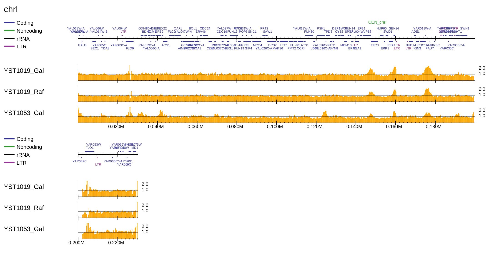

PC ENRICH: Enrichment visualization
-----------------------------------------

For a small genome (e.g., yeast), the sequencing depth is generally enough (> 10 fold).
In such cases, the genome-wide ChIP/Input enrichment distribution is informative because the
technical and biological bias in high throughput sequencing can be minimized.

Download the data
+++++++++++++++++++++++++++++++

Here we use the data of replication analysis (Repli-seq) for *S. serevisiae*, which can be treated as a same manner with ChIP-seq. The original paper is: `Origin Association of Sld3, Sld7, and Cdc45 Proteins Is a Key Step for Determination of Origin-Firing Timing <https://pubmed.ncbi.nlm.nih.gov/22169533-origin-association-of-sld3-sld7-and-cdc45-proteins-is-a-key-step-for-determination-of-origin-firing-timing/>`_

The CRAM-format map files can be downloaded from our GoogleDrive:

- `YST1019_Gal_0min-n2-k1.sort.cram <https://drive.google.com/open?id=1-T5eq6ZgY5kUmRDlbIfFYNMBuwVCQKkc>`_
- `YST1019_Gal_60min-n2-k1.sort.cram <https://drive.google.com/open?id=1-ZabbvJdAYxdaH5MD8s-sMKHkNiEsTQu>`_
- `YST1019_Raf_0min-n2-k1.sort.cram <https://drive.google.com/open?id=1-aCu7DSfEG8EIfYCdwPwsmzjsLXfelY6>`_
- `YST1019_Raf_60min-n2-k1.sort.cram <https://drive.google.com/open?id=1-bzJi5MNjVee5J3chQ7kbhlHTMgqqFut>`_
- `YST1053_Gal_0min-n2-k1.sort.cram <https://drive.google.com/open?id=1-c-FHugX47qUHx50KWshhYS8V2Ns0n_c>`_
- `YST1053_Gal_60min-n2-k1.sort.cram <https://drive.google.com/open?id=1-i0Vbpbd5nLfiTtieD3LLACCf5mVYUiG>`_

Parse2wig
++++++++++++++++++++++++++++++

The command below generates a bigWig data for the six cram files::

    gt=../data/genometable/genometable.sacCer3.txt
    mptable=../data/mptable/mptable.UCSC.sacCer3.50mer.flen150.txt
    for cell in YST1019_Gal YST1019_Raf YST1053_Gal; do
       for min in 0min 60min; do
           cram=${cell}_${min}-n2-k1.sort.cram
           parse2wig+ -i $cram  -o ${cell}_${min} --gt $gt --mptable $mptable -n GR
       done
    done

Make enrichment distribution
++++++++++++++++++++++++++++++++++++++++++

To make a PDF file of the enrichment distribution for S. cerevisiae with the gene annotation, type::

  $ dir=parse2wigdir+
  $ gene=../data/S_cerevisiae/SGD_features.tab
  $ drompa+ PC_ENRICH \
	-i $dir/YST1019_Gal_60min.100.bw,$dir/YST1019_Gal_0min.100.bw,YST1019_Gal,,,200 \
	-i $dir/YST1019_Raf_60min.100.bw,$dir/YST1019_Raf_0min.100.bw,YST1019_Raf,,,200 \
	-i $dir/YST1053_Gal_60min.100.bw,$dir/YST1053_Gal_0min.100.bw,YST1053_Gal,,,200 \
	-o drompa-yeast --gt $gt -g $gene --gftype 2 \
	--scale_ratio 1 --ls 200 --sm 10 --lpp 3

Supply ``--ars`` option to visualize DNA replication origin (ARS) available for *S. cerevisiae* and *S. pombe* (The annotation data can be obtained from `OriDB <http://cerevisiae.oridb.org/>`_)::

  $ dir=parse2wigdir+
  $ ars=../data/S_cerevisiae/ARS-oriDB_scer.txt
  $ drompa+ PC_ENRICH \
	-i $dir/YST1019_Gal_60min.100.bw,$dir/YST1019_Gal_0min.100.bw,YST1019_Gal,,,200 \
	-i $dir/YST1019_Raf_60min.100.bw,$dir/YST1019_Raf_0min.100.bw,YST1019_Raf,,,200 \
	-i $dir/YST1053_Gal_60min.100.bw,$dir/YST1053_Gal_0min.100.bw,YST1053_Gal,,,200 \
	-o drompa-yeast-ARS --gt $gt --ars $ars \
	--scale_ratio 1 --ls 200 --sm 10 --lpp 3

