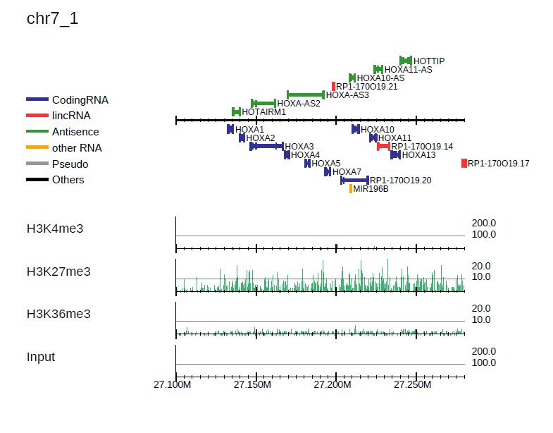

PC_SHARP: Read distribution visualization
---------------------------------------------

drompa+ can take multiple ChIP-input pairs as input. Each pair should be specified with the option ``-i``. It accepts the GTF, refFlat and SGD features.tab obtained from the Saccharomyces Genome Database (SGD) format as gene annotation data (``-g`` option and ``--gftype`` option if necessary).

For example, the command::

  $ dir=parse2wigdir+
  $ drompa+ PC_SHARP \
           -i $dir/H3K4me3.100.bw,$dir/Input.100.bw,H3K4me3 \
           -i $dir/H3K27me3.100.bw,$dir/Input.100.bw,H3K27me3 \
           -i $dir/H3K36me3.100.bw,$dir/Input.100.bw,H3K36me3 \
           -o drompa1 -g refFlat.txt --gt genometable.txt \
           --lpp 2 --showitag 2 --chr 1

generates the PDF files ``drompa1.pdf`` for three ChIP samples (ChIP1, 2, 3 and 4) using the same Input sample (Input), as shown below.

.. image:: img/drompa1.jpg
   :width: 600px
   :align: center

By default, **drompa+ PC_SHARP** visualizes ChIP-read lines only. The ``--showitag 1`` option displays input lines for all ChIP samples while the ``--show itag 2`` option displays only the line for first input.
The latter is recommended when the same input sample is used for all ChIP samples. ``--lpp 2`` output 2 raws per one pdf page. ``--chr 1`` option output the pdf file for chromosome 1 only.

.. note::

   ``--chr`` option takes a string (not an integer) of chromosome name described in genometable.txt. Therefore supply ``--chr X`` for chromosome X, for instance.

Supply ``--scale_tag`` to change the scale of y-axis::

  $ dir=parse2wigdir+
  $ drompa+ PC_SHARP \
           -i $dir/H3K4me3.100.bw,$dir/Input.100.bw,H3K4me3 \
           -i $dir/H3K27me3.100.bw,$dir/Input.100.bw,H3K27me3 \
           -i $dir/H3K36me3.100.bw,$dir/Input.100.bw,H3K36me3 \
           -o drompa2 -g refFlat.txt --gt genometable.txt \
           --lpp 2 --showitag 2 --scale_tag 10 --chr 1

.. image:: img/drompa2.jpg
   :width: 600px
   :align: center

It is also possible to specify sample-specific y-axis scales by supplying it in ``-i`` as follows::

  $ dir=parse2wigdir+
  $ drompa+ PC_SHARP \
           -i $dir/H3K4me3.100.bw,$dir/Input.100.bw,H3K4me3,,,100 \
           -i $dir/H3K27me3.100.bw,$dir/Input.100.bw,H3K27me3,,,10 \
           -i $dir/H3K36me3.100.bw,$dir/Input.100.bw,H3K36me3,,,10 \
           -o drompa3 -g refFlat.txt --gt genometable.txt \
           --lpp 2 --showitag 2 --chr 1

.. image:: img/drompa3.jpg
   :width: 600px
   :align: center

Parameter setting for each sample pair ``-i``
++++++++++++++++++++++++++++++++++++++++++++++++++++

For drompa draw, the option ``-i`` can take the following comma-separated multiple fields:

1. ChIP sample (required);
2. Input sample;
3. Sample label to be shown in figure;
4. peak list to be highlighted;
5. binsize;
6. scale tag;
7. scale ratio;
8. scale pvalue.

Except for the ``ChIP sample``, all the other fields can be omitted.
These options can be used to specify different parameters for each sample pair.
The parameter for each sample is superior to the global parameters.

For example::

    -i H3K4me3.bw,Input.bw,H3K4me3,peak.bed,1000,60

explicitly specifies binsize of bigWig files are 1,000 bp, max value of y_axis is 60, and "peak.bed" as a peak list.
When a peak list (BED format) is specified, drompa+ highlights the peak regions instead of using the internal peak-calling engine.

Visualize specific regions
++++++++++++++++++++++++++++

To focus on specific regions (in this example, the HOX A cluster region), supply a BED file describing the regions to be shown with the option ``-r`` as follows::

  # make BED file "HOXA.txt"
  $ echo -e "chr7\t27100000\t27280000" > HOXA.txt   
  $ cat HOXA.txt
  chr7    27100000        27280000

  # supply "HOXA.txt" with -r option
  $ dir=parse2wigdir+
  $ drompa+ PC_SHARP \
           -i $dir/H3K4me3.100.bw,$dir/Input.100.bw,H3K4me3,,,100 \
           -i $dir/H3K27me3.100.bw,$dir/Input.100.bw,H3K27me3,,,10 \
           -i $dir/H3K36me3.100.bw,$dir/Input.100.bw,H3K36me3,,,10 \
           -o drompa_HOXA -g refFlat.txt --gt genometable.txt \
           --showitag 2 -r HOXA.txt

P-value visualization
+++++++++++++++++++++++

To display the p-value and ChIP/input enrichment lines, supply ``--showratio 1``, ``--showpinter 1`` and ``--showpenrich 1`` options as follows::

  $ dir=parse2wigdir+
  $ drompa+ PC_SHARP \
           -i $dir/H3K4me3.100.bw,$dir/Input.100.bw,H3K4me3 \
           -i $dir/H3K27me3.100.bw,$dir/Input.100.bw,H3K27me3 \
           -i $dir/H3K36me3.100.bw,$dir/Input.100.bw,H3K36me3 \
           -o drompa_pvalue -g refFlat.txt --gt genometable.txt \
           --showratio 1 --showpinter 1 --showpenrich 1 \
           --scale_ratio 3 --scale_pvalue 3 \
           --chr 1

where ``--scale_ratio`` and ``--scale_pvalue`` options change the maximum values for the y axis of the corresponding lines.

.. image:: img/drompa_pvalue.jpg
   :width: 600px
   :align: center

Overlay read distribution
++++++++++++++++++++++++++++

DROMAplus can overlay two samples in one line by specifying the second one with ``--ioverlay`` in the same manner of ``-i``::

  $ dir=parse2wigdir+
  $ drompa+ PC_SHARP \
	-i $dir/H3K4me3.100.bw,$dir/Input.100.bw,H3K4me3,,,100 \
	--ioverlay $dir/H3K36me3.100.bw,$dir/Input.100.bw,H3K36me3,,,10 \
	-o drompa_overlay -g refFlat.txt --gt genometable.txt \
	--lpp 3 --chr 1 \
	--alpha 0.6 \

where ``--alpha`` indicates the transparency of read histogram.

.. image:: img/drompa_overlay.jpg
   :width: 600px
   :align: center

BED annotation and long-range interactions
++++++++++++++++++++++++++++++++++++++++++++++++++++

drompa+ accepts annotation data in BED or BED12 format (e.g., chromatin state file by ChromHMM) with the ``--bed`` option.
The long-range interactions file such as ChIA-PET results are also allowed
with the ``--inter`` option, which takes tab-separated files with six columns: head chr, head start, head end, tail chr, tail start, and tail end. The intra- and inter-chromosomal interactions are shown in red and green, respectively.

For example, the following command generates the PDF file shown in Figure 6::

  $ dir=parse2wigdir+
  $ drompa+ PC_SHARP \
	-i $dir/H3K4me3.100.bw,$dir/Input.100.bw,H3K4me3,,,200 \
	-i $dir/H3K27me3.100.bw,$dir/Input.100.bw,H3K27me3,,,10 \
	-i $dir/H3K36me3.100.bw,$dir/Input.100.bw,H3K36me3,,,10 \
	-o drompa_loops -g refFlat.txt --gt $gt \
	--inter interactions.all.mango,ChIA-PET,mango \
	--inter HICCUPS_looplist.txt,Hi-C,hiccups \
	--lpp 2 --chr 20 --ls 5000

