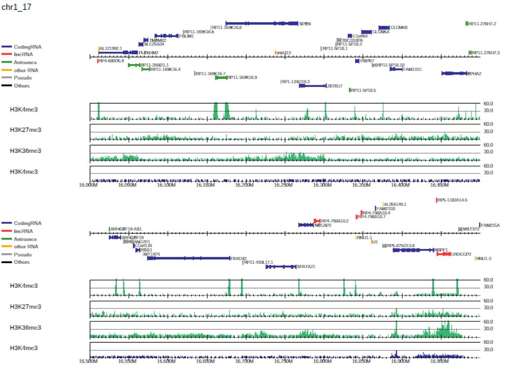

,PC_SHARP: Read distribution visualization
---------------------------------------------

(Optional) Download the BAM files and run parse2wig+ to make the bigWig files for the 100-bp bin::

    $ wget -nc http://hgdownload.soe.ucsc.edu/goldenPath/hg19/encodeDCC/wgEncodeUwHistone/wgEncodeUwHistoneK562H3k4me3StdAlnRep1.bam
    $ wget -nc http://hgdownload.soe.ucsc.edu/goldenPath/hg19/encodeDCC/wgEncodeUwHistone/wgEncodeUwHistoneK562H3k27me3StdAlnRep1.bam
    $ wget -nc http://hgdownload.soe.ucsc.edu/goldenPath/hg19/encodeDCC/wgEncodeUwHistone/wgEncodeUwHistoneK562H3k36me3StdAlnRep1.bam
    $ wget -nc http://hgdownload.soe.ucsc.edu/goldenPath/hg19/encodeDCC/wgEncodeUwHistone/wgEncodeUwHistoneK562InputStdAlnRep1.bam
    $ parse2wig+ -i H3K4me3.bam  -o H3K4me3  --gt genometable.txt -n GR
    $ parse2wig+ -i H3K27me3.bam -o H3K27me3 --gt genometable.txt -n GR
    $ parse2wig+ -i H3K36me3.bam -o H3K36me3 --gt genometable.txt -n GR
    $ parse2wig+ -i Input.bam    -o Input    --gt genometable.txt -n GR

Example usage
+++++++++++++++++++++++++

drompa+ can take multiple ChIP-input pairs as input. Each pair should be specified with the option ``-i``.
For example, the command::

  $ dir=parse2wigdir+
  $ drompa+ PC_SHARP \
           -i $dir/H3K4me3.100.bw,$dir/Input.100.bw,H3K4me3 \
           -i $dir/H3K27me3.100.bw,$dir/Input.100.bw,H3K27me3 \
           -i $dir/H3K36me3.100.bw,$dir/Input.100.bw,H3K36me3 \
           -o drompa1 -g refFlat.txt --gt genometable.txt \
           --lpp 2 --showitag 2 --chr 1

generates the PDF file ``drompa1.pdf`` for three ChIP samples (ChIP1, 2, 3, and 4) using the same input sample (Input), as shown in Fig. 3.1.

   Generating the ``drompa1.pdf`` file for three ChIP samples using the same input sample.

By default, **PC_SHARP** visualizes ChIP-read lines only.
DROMPAplus accepts the GTF or refFlat formats as gene annotation (use ``-g`` and ``--gftype`` options, if necessary). For *S. serevisiae*, ``SGD_features.tab`` obtained from the Saccharomyces Genome Database (SGD) can be used.

The ``--showitag 1`` option displays the input lines for all ChIP samples, while the ``--showitag 2`` option displays only the line for the first input.
The latter is recommended when the same input sample is used for all ChIP samples.
Option ``--lpp 2`` outputs 2 rows per one PDF page.
Option ``--chr 1`` outputs the PDF file for chromosome 1 only.

.. note::

   The ``--chr`` option takes a string (not an integer) of chromosome names, as described in the genometable.txt. Therefore, add ``--chr X`` for chromosome X.

Add ``--scale_tag`` to change the scale of the y-axis::

  $ dir=parse2wigdir+
  $ drompa+ PC_SHARP \
           -i $dir/H3K4me3.100.bw,$dir/Input.100.bw,H3K4me3 \
           -i $dir/H3K27me3.100.bw,$dir/Input.100.bw,H3K27me3 \
           -i $dir/H3K36me3.100.bw,$dir/Input.100.bw,H3K36me3 \
           -o drompa2 -g refFlat.txt --gt genometable.txt \
           --lpp 2 --showitag 2 --scale_tag 10 --chr 1

.. figure:: img/drompa2.jpg
   :width: 600px
   :align: center
   :alt: Alternate

   Generating the ``drompa2.pdf`` file for a specified y-axis scale.

It is also possible to specify the sample-specific y-axis scales by supplying it in option ``-i`` as follows::

  $ dir=parse2wigdir+
  $ drompa+ PC_SHARP \
           -i $dir/H3K4me3.100.bw,$dir/Input.100.bw,H3K4me3,,,100 \
           -i $dir/H3K27me3.100.bw,$dir/Input.100.bw,H3K27me3,,,10 \
           -i $dir/H3K36me3.100.bw,$dir/Input.100.bw,H3K36me3,,,10 \
           -o drompa3 -g refFlat.txt --gt genometable.txt \
           --lpp 2 --showitag 2 --chr 1

   Generating the drompa3.pdf file for a specified sample-specific y-axis scale.

Parameter setting for each sample pair ``-i``
++++++++++++++++++++++++++++++++++++++++++++++++++++

For drompa draw, the option ``-i`` can take the following comma-separated multiple fields:

1. ChIP sample (required);
2. Input sample;
3. Sample label to be shown in figure;
4. Peak list to be highlighted;
5. Binsize;
6. Scale tag;
7. Scale ratio;
8. Scale pvalue.

Except for the ``ChIP sample``, all the other fields can be omitted.
These options can be used to specify different parameters for each sample pair.
The parameter for each sample is superior to the global parameters.

For example::

    -i H3K4me3.bw,Input.bw,H3K4me3,peak.bed,1000,60

explicitly specifies that the bin size of the bigWig files is 1,000 bp, the maximum value of the y-axis is 60, and "peak.bed" is the peak list.
When the peak list (in BED format) is specified, drompa+ highlights the peak regions instead of using the internal peak-calling engine.

Visualize specific regions
++++++++++++++++++++++++++++

To focus on specific regions (in this example, the HOX A cluster region), supply a BED file describing the regions to be shown using the option ``-r`` as follows::

  # Make BED file "HOXA.txt"
  $ echo -e "chr7\t27100000\t27280000" > HOXA.txt
  $ cat HOXA.txt
  chr7    27100000        27280000

  # Specify "HOXA.txt" with -r option
  $ dir=parse2wigdir+
  $ drompa+ PC_SHARP \
           -i $dir/H3K4me3.100.bw,$dir/Input.100.bw,H3K4me3,,,100 \
           -i $dir/H3K27me3.100.bw,$dir/Input.100.bw,H3K27me3,,,10 \
           -i $dir/H3K36me3.100.bw,$dir/Input.100.bw,H3K36me3,,,10 \
           -o drompa_HOXA -g refFlat.txt --gt genometable.txt \
           --showitag 2 -r HOXA.txt

.. figure:: img/drompa_hoxa.jpg
   :width: 400px
   :align: center
   :alt: Alternate

   Visualization of specific regions.

P-value visualization
+++++++++++++++++++++++

P-value visualization can be used to define the appropriate peak-calling threshold for each study and samples.
To display the p-value and ChIP/input enrichment lines, supply the ``--showratio 1``, ``--showpinter 1`` and ``--showpenrich 1`` options as follows::

  $ dir=parse2wigdir+
  $ drompa+ PC_SHARP \
           -i $dir/H3K4me3.100.bw,$dir/Input.100.bw,H3K4me3 \
           -i $dir/H3K27me3.100.bw,$dir/Input.100.bw,H3K27me3 \
           -i $dir/H3K36me3.100.bw,$dir/Input.100.bw,H3K36me3 \
           -o drompa_pvalue -g refFlat.txt --gt genometable.txt \
           --showratio 1 --showpinter 1 --showpenrich 1 \
           --scale_ratio 3 --scale_pvalue 3 \
           --chr 1

where the ``--scale_ratio`` and ``--scale_pvalue`` options change the maximum values of the y-axis of the corresponding lines.
In the p-value lines ("ChIP internal" and "ChIP/Input enrichment"), regions in which the p-value exceeds the threshold are highlighted in red.

.. figure:: img/drompa_pvalue.jpg
   :width: 600px
   :align: center
   :alt: Alternate

   P-value visualization.

Overlay read distribution
++++++++++++++++++++++++++++

DROMAplus can overlay two samples in a single line by specifying the second sample with ``--ioverlay`` in the same manner as ``-i``::

  $ dir=parse2wigdir+
  $ drompa+ PC_SHARP \
	-i $dir/H3K4me3.100.bw,$dir/Input.100.bw,H3K4me3,,,100 \
	--ioverlay $dir/H3K36me3.100.bw,$dir/Input.100.bw,H3K36me3,,,10 \
	-o drompa_overlay -g refFlat.txt --gt genometable.txt \
	--lpp 3 --chr 1 \
	--alpha 0.6 \

where ``--alpha`` indicates the transparency of read histogram.

   Overlay read distribution.

BED annotation and long-range interactions
++++++++++++++++++++++++++++++++++++++++++++++++++++

drompa+ accepts annotation data in BED format (``--bed`` option) and BED12 format (``--bed12`` option, e.g., chromatin state file by ChromHMM).
For BED format, the specified regions are colored in green and gray alternately to distinguish two closely located ones.
For BED12 format, the color is specified in the input file ifself.

For example, the following command generates the PDF file shown in Figure 3.7::

  $ dir=parse2wigdir+
  $ drompa+ PC_SHARP \
	-i $dir/H3K4me3.100.bw,$dir/Input.100.bw,H3K4me3,,,200 \
	-i $dir/H3K27me3.100.bw,$dir/Input.100.bw,H3K27me3,,,10 \
	-i $dir/H3K36me3.100.bw,$dir/Input.100.bw,H3K36me3,,,10 \
	-o drompa_beds -g $gene --gt $gt \
	--bed12 E123_15_coreMarks_dense.bed,ChromHMM \
	--bed drompa4.H3K4me3.peak.tsv,H3K4me3 \
	--bed drompa4.H3K27me3.peak.tsv,H3K27me3 \
	--bed drompa4.H3K36me3.peak.tsv,H3K36me3 \
	--lpp 2 --chr 1 --ls 400

   with BED/BED12 annotations.

Long-range interactions files such as ChIA-PET results, are also allowed with the ``--inter`` option,
which takes tab-separated files with six columns: head chr, head start, head end, tail chr, tail start, and tail end.
The color indicates the significance of the interaction.

For example, the following command generates the PDF file shown in Figure 3.8::

  $ dir=parse2wigdir+
  $ drompa+ PC_SHARP \
	-i $dir/H3K4me3.100.bw,$dir/Input.100.bw,H3K4me3,,,200 \
	-i $dir/H3K27me3.100.bw,$dir/Input.100.bw,H3K27me3,,,10 \
	-i $dir/H3K36me3.100.bw,$dir/Input.100.bw,H3K36me3,,,10 \
	-o drompa_loops -g refFlat.txt --gt $gt \
	--inter interactions.all.mango,ChIA-PET,mango \
	--inter HICCUPS_looplist.txt,Hi-C,hiccups \
	--lpp 2 --chr 20 --ls 5000

.. figure:: img/drompa_loop.jpg
   :width: 600px
   :align: center
   :alt: Alternate

   with long-range interactions.

Additional information
+++++++++++++++++++++++++++++++++++++

Wig/bedGraph/bigWig data generated by other tools
^^^^^^^^^^^^^^^^^^^^^^^^^^^^^^^^^^^^^^^^^^^^^^^^^^^^^^^^^^^^

When applying wig data (**H3K4me3.100.bw** for example), drompa+ also uses information from the corresponding stats file (**H3K4me3.100.tsv** for example) to reduce the execution time.
If the stats file is lacked (i.e., when applying data generated by other tools), drompa+ automatically generates a light stats file and uses it thereafter.

Visualizing negative values
^^^^^^^^^^^^^^^^^^^^^^^^^^^^^^^^^

Generally, Wig/bedGraph/bigWig data of ChIP-seq data do not take negative values. Therefore, drompa+ does not have the line for negative values. If the users want to visualize negative values (e.g., log-scale data values or principal component data), the ``--shownegative`` option can be used as follows::

  $ dir=parse2wigdir+
  $ drompa+ PC_SHARP \
           -i $dir/H3K4me3.100.bw,$dir/Input.100.bw,H3K4me3 \
           -i $dir/H3K27me3.100.bw,$dir/Input.100.bw,H3K27me3 \
           -i $dir/H3K36me3.100.bw,$dir/Input.100.bw,H3K36me3 \
           -o drompa1withnegative -g refFlat.txt --gt genometable.txt \
           --shownegative --bn 4 --chr 1

.. figure:: img/drompa1withnegative.jpg
   :width: 600px
   :align: center
   :alt: Alternate

   Visualization of negative numbers.
