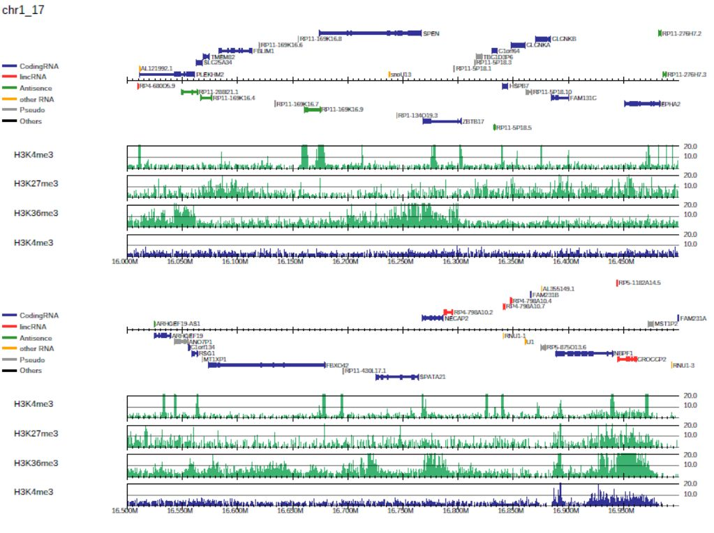

PC_SHARP: Read distribution visualization
---------------------------------------------

drompa+ can take multiple ChIP-input pairs as input. Each pair should be specified with the option ``-i``. For example, the command::

  $ dir=parse2wigdir+
  $ drompa+ PC_SHARP \
  $         -i $dir/H3K4me3.100.bw,$dir/Input.100.bw,H3K4me3 \
  $         -i $dir/H3K27me3.100.bw,$dir/Input.100.bw,H3K27me3 \
  $         -i $dir/H3K36me3.100.bw,$dir/Input.100.bw,H3K36me3 \
  $         -o drompa1 -g refFlat.txt --gt genometable.txt \
  $         --lpp 2 --showitag 2 --scale_tag 30 --chr 1

generates the PDF files ``drompa1.pdf`` for three ChIP samples (ChIP1, 2, 3 and 4) using the same Input sample (Input), as shown below.

.. image:: img/drompa1.jpg
   :width: 500px
   :align: center

By default, **drompa+ PC_SHARP** visualizes ChIP-read lines only. The ``--showitag 1`` option displays input lines for all ChIP samples while the ``--show itag 2`` option displays only the line for first input.
The latter is recommended when the same input sample is used for all ChIP samples.
``--scale_tag`` specifies the scale of y-axis. ``--lpp 2`` output 2 raws per one pdf page. ``--chr 1`` option output the pdf file for chromosome 1 only.

DROMPAplus accepts the Gtf, refFlat and SGD features.tab obtained from the Saccharomyces Genome Database (SGD) format as gene annotation data (``-g`` option and ``--gftype`` option).

P-value visualization
+++++++++++++++++++++++

To display the p-value and ChIP/input enrichment lines, supply ``--showratio 1``, ``--showpinter 1`` and ``--showpenrich 1`` options as follows::

  $ dir=parse2wigdir+
  $ drompa+ PC_SHARP \
  $         -i $dir/H3K4me3.100.bw,$dir/Input.100.bw,H3K4me3 \
  $         -i $dir/H3K27me3.100.bw,$dir/Input.100.bw,H3K27me3 \
  $         -i $dir/H3K36me3.100.bw,$dir/Input.100.bw,H3K36me3 \
  $         -o drompa2 -g refFlat.txt --gt genometable.txt \
  $         --showratio 1 --showpinter 1 --showpenrich 1 \
  $         --scale_ratio 3 --scale_pvalue 3 \
  $         --chr 1

where ``--scale_ratio`` and ``--scale_pvalue`` options change the maximum values for the y axis of the corresponding lines.

Visualize specific regions
++++++++++++++++++++++++++++

To focus on specific regions (in this example, the HOX A cluster region), supply a BED file describing the regions to be shown with the option ``-r``as follows::

  $ echo -e "chr7\t27100000\t27280000" > HOXA.txt
  $ cat HOXA.txt
  chr7    27100000        27280000
  $ dir=parse2wigdir+
  $ drompa+ PC_SHARP \
  $         -i $dir/H3K4me3.100.bw,$dir/Input.100.bw,H3K4me3 \
  $         -i $dir/H3K27me3.100.bw,$dir/Input.100.bw,H3K27me3 \
  $         -i $dir/H3K36me3.100.bw,$dir/Input.100.bw,H3K36me3 \
  $         -o drompa_hoxa -g refFlat.txt --gt genometable.txt \
  $         --showitag 2 --scale_tag 20 -r HOXA.txt

.. image:: img/drompa_hoxa.jpg
   :width: 300px
   :align: center

Specify different parameter for each sample pair
++++++++++++++++++++++++++++++++++++++++++++++++++++

For drompa draw, the option ``-i`` can take the following comma-separated multiple fields:

1. ChIP sample (required);
2. Input sample;
3. Sample label to be shown in figure;
4. peak list to be highlighted;
5. binsize;
6. scale tag;
7. scale ratio;
8. scale pvalue.

Except for the ``ChIP sample``, all the other fields can be omitted.
The parameter for each sample is superior to the global parameters.

When a peak list (BED format) is specified, drompa+ highlights the peak regions instead of using the internal peak-calling engine.
The rest of the options can be used to specify different parameters for each sample pair.

For example, the command::

  $ drompa_draw PC_SHARP -p ChIPseq --gt genometable.txt \
  $ -i $ChIP1,$Input,ChIP1,ChIP1peak.bed,,50 \
  $ -i $ChIP2,$Input,ChIP2,ChIP2peak.bed,,80 \
  $ -i $ChIP3,$Input,ChIP3,ChIP3peak.bed,1000,60 \
  $ -i $ChIP4,$Input,ChIP4,ChIP4peak.bed,1000,60 \
  $ -g refFlat.txt --chr 4 --ls 10000

generates the figure below.

BED annotation and long-range interactions
++++++++++++++++++++++++++++++++++++++++++++++++++++

drompa+ accepts annotation data in BED or BED6 format (e.g., ChromHMM results [9]) with the ``--bed`` option.
The long-range interactions file such as ChIA-PET results are also allowed
with the ``--inter`` option, which takes tab-separated files with six columns: head chr, head start, head end, tail chr, tail start, and tail end. The intra- and inter-chromosomal interactions are shown in red and green, respectively.

For example, the following command generates the PDF file shown in Figure 6::

  $ drompa_draw PC_SHARP -o ChIP-seq --gt genometable.txt $s1 $s2 $s3 $s4 \
  $ -g refFlat.txt --bed chromhmm.bed,emission \
  $ --inter ChIA-PET.bed,interaction
