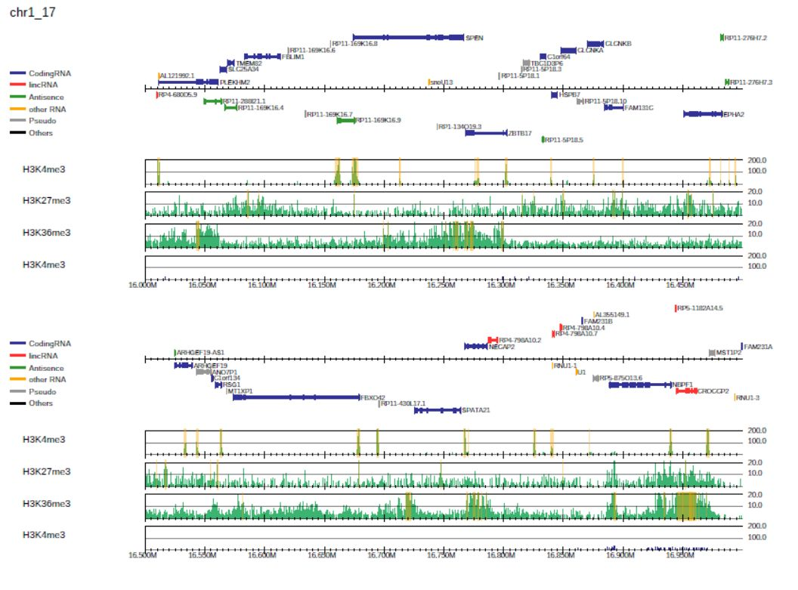
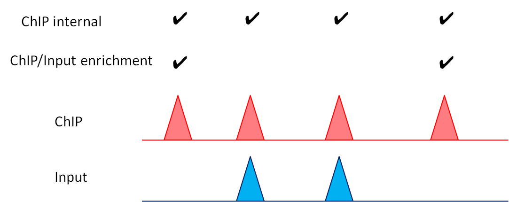

Peak calling
---------------------------------------------

In **PC_SHARP** and **PC_BROAD** mode, drompa+ can call peaks by suppying ``--callpeak`` option::

  $ dir=parse2wigdir+
  $ drompa+ PC_SHARP \
           -i $dir/H3K4me3.100.bw,$dir/Input.100.bw,H3K4me3,,,100 \
           -i $dir/H3K27me3.100.bw,$dir/Input.100.bw,H3K27me3,,,10 \
           -i $dir/H3K36me3.100.bw,$dir/Input.100.bw,H3K36me3,,,10 \
           -o drompa4 -g refFlat.txt --gt genometable.txt \
           --lpp 2 --showitag 2 --callpeak

Peak regions are highlighted in orange.
The peak list for each sample pair is also outputted as "<outputname>.<label>.peak.tsv"::

   $ ls drompa4.*.tsv
   drompa4.H3K27me3.peak.tsv  drompa4.H3K36me3.peak.tsv  drompa4.H3K4me3.peak.tsv

The peak list is tab-delimited text format and can be opened in a text editor or Microsoft Excel. It has the following columns:

- chromosome name
- start position
- end position
- peak summit (center of summit bin)
- peak width
- ChIP read pileup
- Input read pileup
- ChIP/Input enrichment (pileup)
- P-value (ChIP internal)
- P-value (ChIP/Input enrichment)
- peak name.

| By default, chromosomes Y and M (Mt) are ignored for the analysis. Supply the ``--includeYM`` option to include these chromosomes.
| When supplying ``--chr`` option, peaks for only the specified chromosome are called.
| Supply ``--offpdf`` option to omit pdf file generatoin and obtain peak lists only.

Detail of significance test
++++++++++++++++++++++++++++++++++++

**PC_SHARP** and **PC_BROAD** mode adopt a two-step procedure for significance testing of peak calling.

- The first step identifies significantly enriched sites compared to a background null model, assuming a Poisson distribution with local background region (100 kbp).
- From these candidate sites, the second step identifies significantly enriched ones compared to the input control based on the binomial distribution.

Accordingly, there are multiple thresholds for peak calling as below:

- Main thresholds:

     - ``--pthre_internal``: p-value of the first step (ChIP-internal enrichment)
     - ``--pthre_enrich``: p-value of the second step (ChIP/Input enrichment)

- Optional thresholds:

     - ``--ethre``: ChIP/Input enrichment
     - ``--ipm``: normalized intensity (height) of peak summit

We recommend ``--pthre_enrich`` option as the main threshold for peak calling.
See ``--help`` for the default value of these threholds for each drompa+ mode. 

Peak calling without the input sample
++++++++++++++++++++++++++++++++++++++++++

When the input sample is omitted, drompa+ calls peaks using the ChIP sample only. The second step is omitted. However, we strongly recommend that the ChIP sample is compared with the corresponding input data to decrease the number of false-positive sites derived from repetitive regions.

Peak calling in **PC_ENRICH** mode
++++++++++++++++++++++++++++++++++++

**PC_ENRICH** mode does not use significance test but simply call regions in which containing ChIP/Input enrichments above the enrichment threshold (``-ethre``, 2.0 in default) and the peak intensity threshold (``--ipm``, 5.0 in default). 