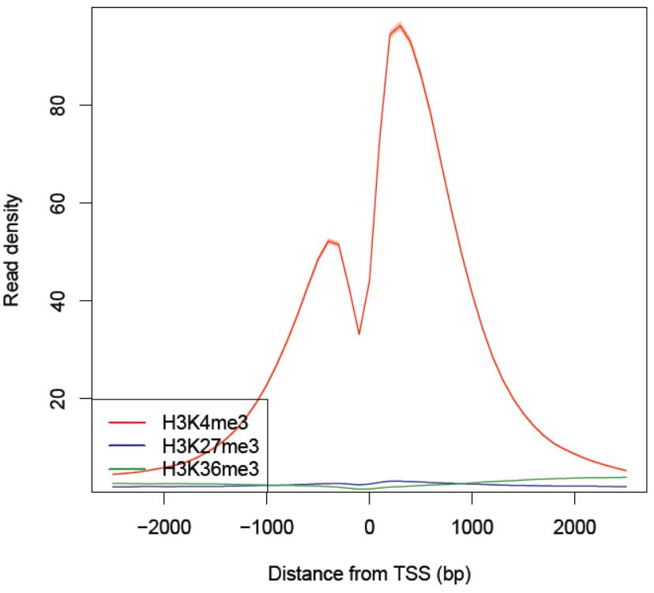
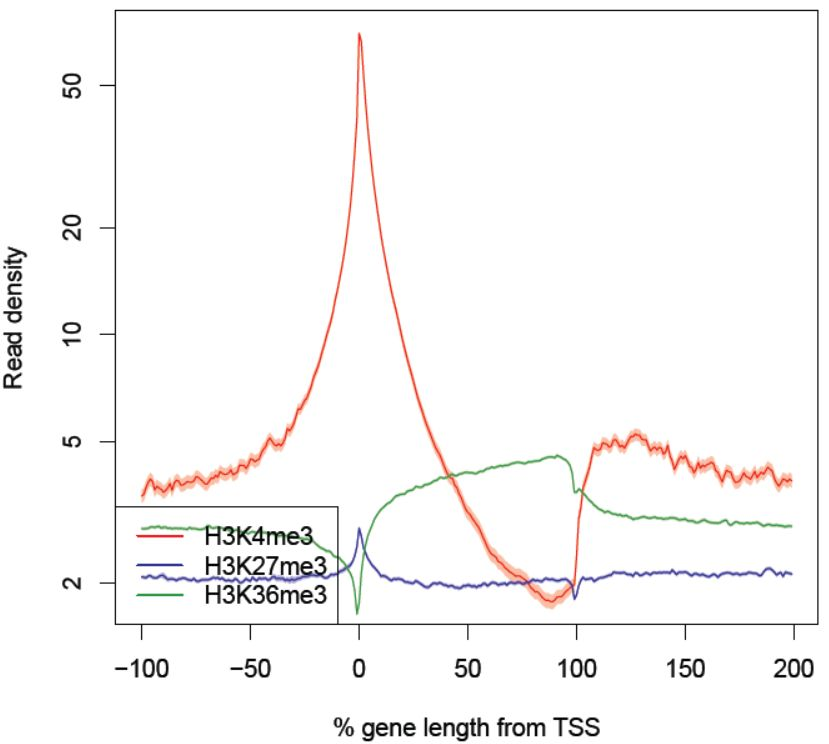
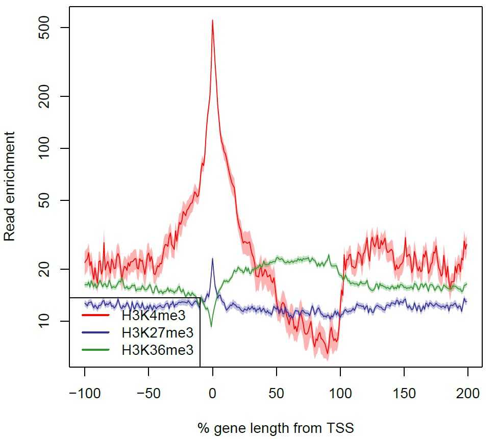
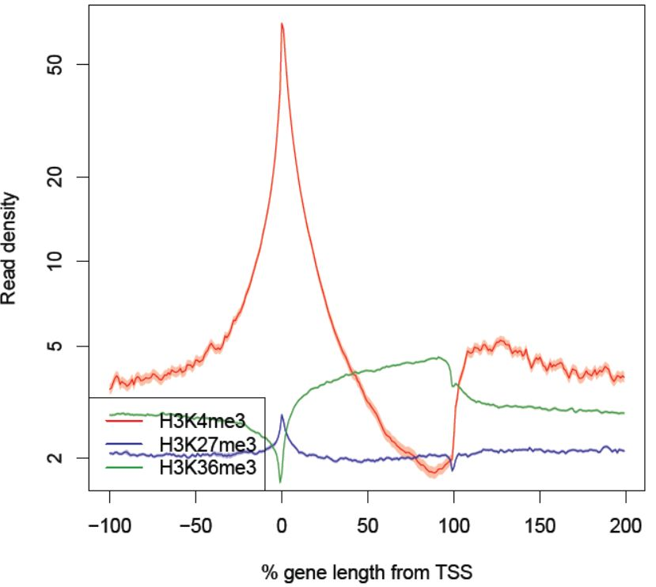

PROFILE: Aggregation plot (using R)
-----------------------------------------

The **PROFILE** mode makes an aggregation plot by supplying:

-  ``--ptype 0``: around transcription start sites (TSS)
-  ``--ptype 1``: around transcription termination sites (TTS)
-  ``--ptype 2``: divide genes into 100 subregions
-  ``--ptype 3``: around peaks

In **PROFILE** mode, short genes (< 1kbp) are ignored.

The following command outputs an averaged profile of ChIP reads around TSSs::

    dir=parse2wigdir+
    drompa+ PROFILE --ptype 0 \
       -i $dir/H3K4me3.100.bw,$dir/Input.100.bw,H3K4me3 \
       -i $dir/H3K27me3.100.bw,$dir/Input.100.bw,H3K27me3 \
       -i $dir/H3K36me3.100.bw,$dir/Input.100.bw,H3K36me3 \
       -o aroundtss -g refFlat.txt --gt genometable.txt

   The read density as a function of the distance from the TSS.

The output files are as follows:

- a PDF file (aroundTSS.PROFILE.averaged.ChIPread.pdf)
- a corresponding .tsv file for each samples (here aroundTSS.PROFILE.averaged.ChIPread.H3K27me3.tsv, aroundTSS.PROFILE.averaged.ChIPread.H3K36me3.tsv and aroundTSS.PROFILE.averaged.ChIPread.H3K4me3.tsv)
- a R script to generate the PDF file using .tsv files (aroundTSS.PROFILE.averaged.ChIPread.R)

Similarly, the ``--ptype 1`` option generates  an averaged profile around TESs.

The ``--ptype 2`` option generates the averaged profile arouond whole gene bodies (gene length is normalized)::

    dir=parse2wigdir+
    drompa+ PROFILE --ptype 2 \
       -i $dir/H3K4me3.100.bw,$dir/Input.100.bw,H3K4me3 \
       -i $dir/H3K27me3.100.bw,$dir/Input.100.bw,H3K27me3 \
       -i $dir/H3K36me3.100.bw,$dir/Input.100.bw,H3K36me3 \
       -o aroundgene -g refFlat.txt --gt genometable.txt

   The read density as a function of the percentage of the gene length from the TSS.

The shaded regions indicate the 95% confidence interval.

Averaged profile of ChIP/Input enrichment
++++++++++++++++++++++++++++++++++++++++++++++++++++++

Using the ``--stype 1`` option, **drompa+** plots an averaged profile of ChIP/Input enrichment.
It is noted that this is "an average of enrichment for all sites", not "an enrichment between the averaged ChIP reads and Input reads for all sites."::

    dir=parse2wigdir+
    drompa+ PROFILE --ptype 2 --stype 1 \
       -i $dir/H3K4me3.100.bw,$dir/Input.100.bw,H3K4me3 \
       -i $dir/H3K27me3.100.bw,$dir/Input.100.bw,H3K27me3 \
       -i $dir/H3K36me3.100.bw,$dir/Input.100.bw,H3K36me3 \
       -o aroundgene.enrich -g refFlat.txt --gt genometable.txt

The output PDF file is named "profile-aroundGene.PROFILE.averaged.Enrichment.pdf."

   The read enrichment as a function of the percentage of the gene length from the TSS.

Modify plot parameters
++++++++++++++++++++++++++++++++

To modify the plot parameters (e.g., range of y-axis), change parameters descrived in the generated R script and remake the PDF file as follows::

    $ R --vanilla < aroundTSS.PROFILE.averaged.ChIPread.R

Normalizing the read number for the specified regions
+++++++++++++++++++++++++++++++++++++++++++++++++++++++++++++++++++++

The averaged read number in the background regions sometimes highly varies among samples due to the effect of repetitive regions or sparsely mapped reads (low background uniformity).
..The option ``--ntype 1`` normalizes the read number for total number of reads mapped in the regions used by **PROFILE** command (e.g., genic regions for ``--ptype 2``)::

    dir=parse2wigdir+
    drompa+ PROFILE --ptype 2 --ntype 1 \
       -i $dir/H3K4me3.100.bw,$dir/Input.100.bw,H3K4me3 \
       -i $dir/H3K27me3.100.bw,$dir/Input.100.bw,H3K27me3 \
       -i $dir/H3K36me3.100.bw,$dir/Input.100.bw,H3K36me3 \
       -o aroundgene2 -g refFlat.txt --gt genometable.txt

   The read enrichment with ``--ntype 1`` option.
