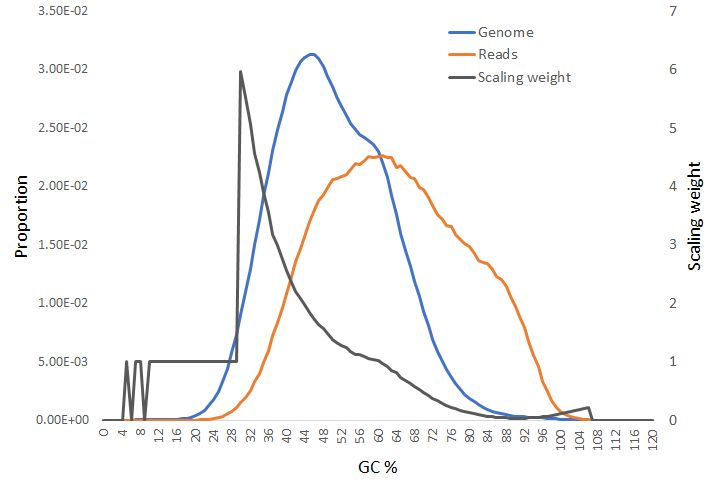

Parse2wig
============

Parse2wig preprocesses an input mapfile into bin data (the number of mapped read per bin). A sample script file for tutorial is in “tutorial” derectory.

Example
-------------------------------

The command below generates a bigWig data ``ChIP.100.bw`` and a statistics file ``ChIP.100.tsv`` in ``parse2wigdir+`` directory::

  $ parse2wig+ -i ChIP.bam -o ChIP --gt genometable.txt
  (...)
  $ ls parse2wigdir+
  parse2wigdir+/ChIP.100.bw   parse2wigdir+/ChIP.100.tsv

The default bin size is 100 bp.
The input file format is automatically detected by postfix (.sam/.bam/.cram/.bowtie/.tagalign(.gz)).
If the detection does not work well, supply ``-f`` option (e.g., ``-f BAM``).

parse2wig+ allows multiple input files (separated by ",")::

  $ parse2wig+ -i ChIP1.bam,ChIP2.bam,ChIP3.bam -o ChIP --gt genometable.txt

If you want to generate it as bedGraph format, supply ``--outputformat 2``::

  $ parse2wig+ -i ChIP.bam -o ChIP --gt genometable.txt --outputformat 2

In default, parse2wig+ omits to output bins in which the value is zero to reduce the file size. Supply ``--outputzero`` to output all bins::

  $ parse2wig+ -i ChIP.bam -o ChIP --gt genometable.txt --outputzero

For bin size 100kbp::

  $ parse2wig+ -i ChIP.bam -o ChIP --gt genometable.txt --binsize 100000

Supply ``-p`` to use multiple CPUs::

  $ parse2wig+ -i ChIP.bam -o ChIP --gt genometable.txt -p 4

.. note::

    * Multithreading is activated in strand-shift profile for estimating frangment length and GC content estimation. When suppying ``--nomodel`` option and not using ``--chrdir`` option, multithreading will make no differece.

Quality check
------------------------

The statistics file ``parse2wigdir+/ChIP.100.tsv`` describes various quality values and other information of the input mapfile as follows:

- **Redundancy threshold**: threshold for PCR bias
- **Library complexity**: non-redundant read fraction for 10 million mapped reads (supply ``--ncmp`` to change this mapped read number). This score is put in parentheses when the number of mapped reads is insufficient.
- **GC summit** (when supplying ``--GC`` option): the summit of GC distribution

- **Length**: total length of the genome and chromosomes
- **Mappable base and mappability**: mappability calculated from specified mappability file
- **Total reads**: the number of mapped reads
- **Non-redundant reads**: the number of reads remaining after PCR-bias filtering
- **Redundant reads**: the number of reads filtered by PCR-bias filtering (mapped on forward, reverse and both strands are outputted)
- **Reads (GCnormed)** (when supplying ``--GC`` option): read number after GC normalization
- **Read depth**: the expected number of mapped reads per base pair. Namely, :math:`depth = n^{reads} * fragmentlength / genomelength`;
- **Scaling weight**: scaling weight for the read normalization
- **Normalized read number**: read number after the normalization
- **FRiP score** (when supplying ``--bed`` option): fraction of reads in peaks. .

Fragment length estimation
+++++++++++++++++++++++++++++++++++

For single-end data, DROMPAplus internally uses `SSP <https://github.com/rnakato/SSP>`_ to estimate averaged fragment length and extends to the length.
When ``--nomodel`` option is supplied, DROMPAplus omits to use SSP and extends read to a predetermined length (150 bp in default. Supply ``--flen`` option to change this value). 

Paired-end file
+++++++++++++++++++++++++++++++++++

Supply ``--pair`` option for paired-end files::

  $ parse2wig+ --pair -i ChIP.paired.bam -o ChIP --gt genometable.txt

In ``--pair`` mode, the fragment length of each read pair is calculated automatically.
parse2wig+ discards read pairs that are mapped onto different chromosomes or the fragment length is longer than 500bp (in default, specified ``--maxins`` to change).

.. note::

   * When parsing paired-end mapfiles with single-end mode, warning messages will be outputted.
   * In TagAlign format, paired-end data is not supported.

PCR bias filtering
++++++++++++++++++++++

parse2wig+ filters "redundant reads" (reads starting exactly at the same 5' ends) as "PCR bias".
This filtering step can be omitted by supplying ``--nofilter`` option.

By default, the threshold of filtering is defined as::

	threshold = max(1, 10 * E_genome)

where E\ :sub:`genome`\  is the averaged read depth.
10 * E\ :sub:`genome`\  can be greater than 1 for a small genome (e.g., yeast).
Additionally, ``--thre_pb`` option can be used to fix this threshold.

Multiple mapped reads
++++++++++++++++++++++++++++++

parse2wig+ recognizes the uniquely mapped and multiple mapped reads using 'NH' flag in SAM/BAM/CRAM format. For multiple mapped reads, each mapped locus is weighted equally.

Some mapping tools (e.g., Bowtie and BWA) do not output the 'NH' column. In this case, all reads are considered as uniquely mapped reads.

Total read normalization
---------------------------------

parse2wig+ has the ``-n`` option to normalize the read distribution based on the number of nonredundant reads

* **-n NONE** (default); not normalize
* **-n GR**; for whole genome, read number
* **-n GD**; for whole genome, read depth
* **-n CR**; for each chromosome, read number
* **-n CD**; for each chromosome, read depth

``-n GR`` is recommended that is a typical total read normalization.
If the mapped read number is quite different among chromosomes (e.g., mapfile contains chrX only), consider to use ``-n CR``. Also, use ``--nrpm`` option to change read number after normalization (default: 20 million). 

For example, the command below scales bin data so that the total number of nonredundant reads is 10 million::

    $ parse2wig+ -i sample.sam -o sample --gt genometable.txt -n GR --nrpm 10000000

.. note::

       it is not recommended to scale a small number of reads up to a larger number (e.g., 1 million → 10 million) because that will result in plenty of background noise.

Higher resolution with central regions of fragments
-------------------------------------------------------------

When high resolution is required (e.g., nucleosome-seq), consider ``--rcenter`` option that focus on the the central region of each fragment. 
For example, the command below considers only 50 bp around the center of each fragment::

  $ parse2wig+ -i ChIP.bam -o ChIP --gt genometable.txt --rcenter 50

Mappability information
-----------------------------------------

parse2wig+ utilizes three types of genome mappability information.
See :doc:`Appendix`  for the detail how to generate the mappability files.

Mappable chromosome length
+++++++++++++++++++++++++++++

With ``--mptable`` option, parse2wig+ considers the number of mappable bases as the genome/chromosome length.::

  $ parse2wig+ -i ChIP.bam -o ChIP --gt genometable.txt --mptable mptable.txt

The mappability files for several species are available in "data/mptable" directory. When ``--mptable`` is not supplied, all bases are considered as mappable.

Base-pair level mappability
+++++++++++++++++++++++++++++

To precisely calculate genome coverage and/or GC content distribution in base-pair resolution, suppy ``--mpdir`` option as follows::

  $ parse2wig+ -i ChIP.bam -o ChIP --gt genometable.txt --mpdir <mpdir>

where "<mpdir>" indicates the directory that contains the gzipped binary mappability files (**map_chr*_binary.txt.gz**).

Bin-level mappability
+++++++++++++++++++++++++++++

When supplying ``--mpdir`` option, parse2wig+ automatically generates bin-level mappability files (**map_chr*.<binsize>.wig.gz**) first time and use them from then. These files are used to normalize wig data based on the mappability. The bins in which the mappability is lower than the threshold (``--mpthre`` option, < 0.3 as default) are excluded from mappability normalization (and GC normalization).

GC content estimation
------------------------------

parse2wig+ can estimate and normalize based on GC contents of mapped reads as follows::

  $ parse2wig+ -i ChIP.bam -o ChIP --gt genometable.txt \
    --chrdir <chromosomedir>

where ``--chrdir`` option that indicates the directory of the reference chromosome FASTA files. ``<chromosomedir>`` is the directory that contains the FASTA files of all chromosomes described in ``genometable.txt`` with corresponding filenames.
For example, if ``chr1`` is in ``genometable.txt``, there should be ``chr1.fa`` in ``<chromosomedir>``.
parse2wig+ uses the longest chromosome described in "mptable.txt" or "genometable.txt" for GC content estimation.

In GC content estimation, parse2wig+ consider 120 bp except for 5 bases of 5' edge (i.e. from 6 bp to 125 bp of each fragment) because the 5' edge often contains biased GC distribution. Use ``--flen4gc`` to change the length to be considered.

GC stats file
+++++++++++++++++++++

The command above outputs the GC distribution file "ChIP.GCdist.tsv" in the output directory (*parse2wig+dir*). 
Using this GC distribution file, the user can draw GC contents/weight distribution of the input file and the genome sequence like below.

The contents are the following:

- GC: the GC content;
- genome prop: the proportion of the mappable bases containing the GC contents, then :math:`prop^{genome}_{GC} = n^{genome}_{GC}/G`, where :math:`n^{genome}_{GC}` is the number of positions containing the GC contents and :math:`G` is the total number of mappable bases;
- read prop: the proportion of the reads (fragments) containing the GC contents, then :math:`prop^{reads}_{GC} = n^{reads}_{GC}/N`, where :math:`n^{reads}_{GC}` are the number of reads containing the GC contents and :math:`N` is the total number of mapped reads;
- depth: the ratio of GC contents between reads and genome sequence, namely, :math:`depth_{GC} = n^{reads}_{GC}/n^{genome}_{GC}`;
- Scaling weight: the ratio of the proportion between reads and genome sequence, namely, :math:`weight = prop^{genome}_{GC}/prop^{reads}_{GC}`;

      - Note: because the weight estimated from very low :math:`depth_{GC}` causes false-positive peaks, by default parse2wig+ sets a weight of 1 to the GC content with :math:`depth_{GC}` less than 0.001, and a weight of 0 to the GC content having :math:`prop^{genome}_{GC}` less than 0.00001. The former threshold is ignored when supplying the ``--gcdepthoff`` option.

The summit of GC content distribution for reads (orange, GC% = 61 in this figure) is important for assessing GC bias. This score is also outputted in the stats file (e.g., H3K4me3.100.tsv).

GC normalization
+++++++++++++++++++++++++++++++++

When supplying ``--chrdir`` option, the output wig data describes the read distribution normalized by GC contents, in which each read is scaled based on its GC content. However, it should be noted that GC normalization often overcorrects the true read signals. When samples have a GC distribution quite different from other samples, it is preferable to re-prepare them rather than using them with GC normalization.
