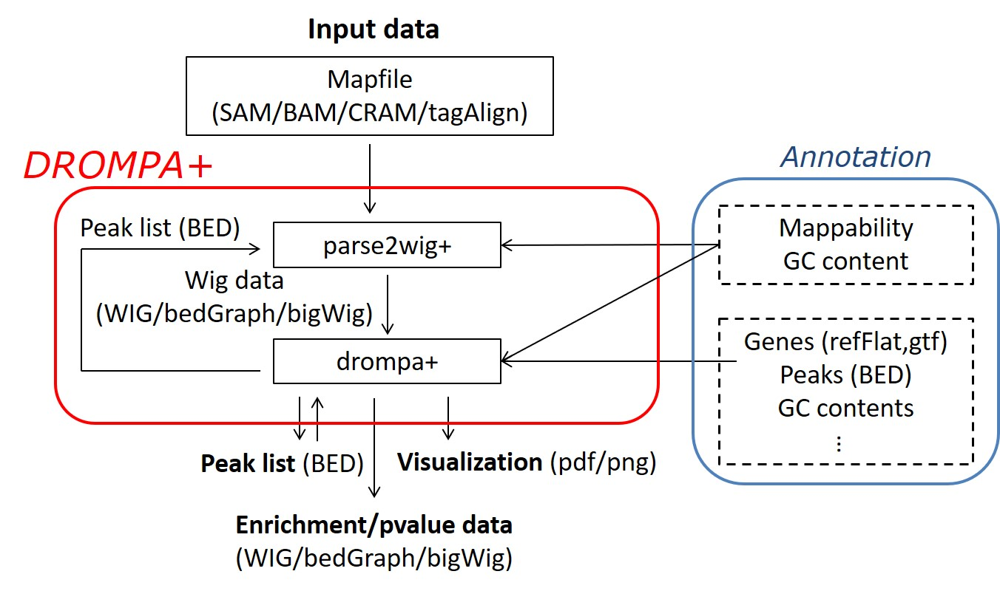

=====================================================
DROMPAplus: a pipeline tool for ChIP-seq analysis
=====================================================

DROMPA (DRaw and Observe Multiple enrichment Profiles and Annotation) is a ChIP-seq pipeline tool that meets various needs, including quality check, analysis, and visualization of multiple ChIP samples.

The main features of DROMPAplus are:

* Applicable to any species whose genomic sequence is available;
* Accepts multiple input/output file formats (SAM, BAM, Bowtie, WIG, BED, TagAlign(.gz), bigWig, and bedGraph);
* Normalization using mappability and GC content;
* Visualize ChIP/input enrichment and p-value of statistical tests along with the read distribution itself;
* Output PDF format that is suitable to share the visualization on a cloud;
* In addtion to typical peak calling, various types of ChIP-seq analysis are available.

Contents:
---------
.. toctree::
   :numbered:
   :glob:
   :maxdepth: 1

   content/Install
   content/parse2wig
   content/drompa
   content/Tutorial

Citation:
---------

* Nakato R., Sakata T., Methods for ChIP-seq analysis: A practical workflow and advanced applications, *submitted*.

Contact:
---------

:Mail: rnakato AT iam.u-tokyo.ac.jp
:Twitter: @RyuichiroNakato
